<h1 align="center">
  
</h1>

  <strong>Estudiante de Ingeniería de Software | UdeC</strong>

  <strong>Desarrollador enfocado en soluciones con Python y Arquitectura POO</strong>

---

### 🚀 Sobre Mí

*  **Orgullosamente Colombiano.**
* 🎓 Actualmente cursando **3er semestre** de Ingeniería de Software en la **UdeC**.
* 🐍 Especialista en **Python**, interfaces con **Tkinter** y **Flet**.
* 🤖 **Experto en Automatización**: Uso **GitHub Actions** para mis estadísticas.
* 🛠️ **Dominio de Git & GitHub**: Gestión de flujos de trabajo y despliegues.
* 🤝 **Abierto a colaborar** en proyectos de **POO** y retos de software.
* 💬 **Puedo orientarte en**: Python moderno y lógica para **Flutter**.

 

### 📫 Conecta conmigo

  &nbsp;&nbsp;&nbsp;
  &nbsp;&nbsp;&nbsp;
  &nbsp;&nbsp;&nbsp;
  &nbsp;&nbsp;&nbsp;
  &nbsp;&nbsp;&nbsp;
  

---

### 🔋 Mi Stack Tecnológico

  &nbsp;&nbsp;&nbsp;&nbsp;&nbsp;&nbsp;
  &nbsp;&nbsp;&nbsp;&nbsp;&nbsp;&nbsp;
  

  &nbsp;&nbsp;&nbsp;&nbsp;&nbsp;&nbsp;
  &nbsp;&nbsp;&nbsp;&nbsp;&nbsp;&nbsp;
  

---

### 🧠 Proyectos Destacados

  
  

  

---

<h2 align="center">👾 GitHub</h2>

  
  

  

  <i>"El código es arte, y yo estoy aprendiendo a pintar."</i>

