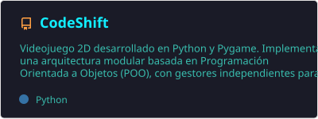
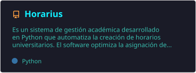
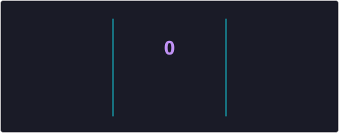
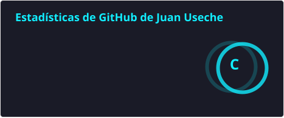

<h1 align="center">
  
</h1>

  <strong>Estudiante de Ingeniería de Software | UdeC</strong>

  <strong>Desarrollador de Software enfocado en resolución de problemas y arquitectura limpia</strong>

### 🚀 Sobre Mí

* 🇨🇴 **Orgullosamente Colombiano.**
* 🎓 Estudiante de **Ingeniería de Software en la UdeC**.
* 🧠 **Filosofía**: Enfoque agnóstico al lenguaje; la prioridad es la arquitectura limpia y resolver el problema con la mejor herramienta.
* 🛠️ **Áreas de Trabajo**: Interfaces modernas con **Flet** y Desktop, backend modular y scripts de automatización.
* 🌐 **Explorando Actualmente**: Desarrollo web con **PHP**, bases de datos relacionales y algoritmos en **PPL (HP Prime)**.
* ⚙️ **CI/CD & Cloud**: Workflows con **GitHub Actions** y despliegues serverless en **Vercel**.
* 💬 **Conversemos sobre**: Arquitectura de software, patrones de diseño y buenas prácticas.

 

### 📫 Conecta conmigo

  &nbsp;&nbsp;
  &nbsp;&nbsp;
  &nbsp;&nbsp;
  &nbsp;&nbsp;
  &nbsp;&nbsp;
  

---

### 🔋 Mi Stack Tecnológico

  <!-- Fila 1: Herramientas, lógica y frontend (7) -->
  

    &nbsp;&nbsp;
    &nbsp;&nbsp;
    &nbsp;&nbsp;
    &nbsp;&nbsp;
    &nbsp;&nbsp;
    &nbsp;&nbsp;
    
  

  <!-- Fila 2: Control de versiones, backend, DB y cloud (6) -->
  

    &nbsp;&nbsp;
    &nbsp;&nbsp;
    &nbsp;&nbsp;
    &nbsp;&nbsp;
    &nbsp;&nbsp;
    
  

---

### 🧠 Proyectos Destacados

  &nbsp;
  

---

<h2 align="center">👾 GitHub</h2>

  
  

  

  <i>"El código es arte, y yo estoy aprendiendo a pintar."</i>

